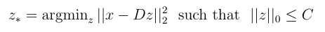
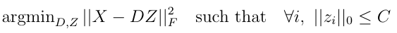
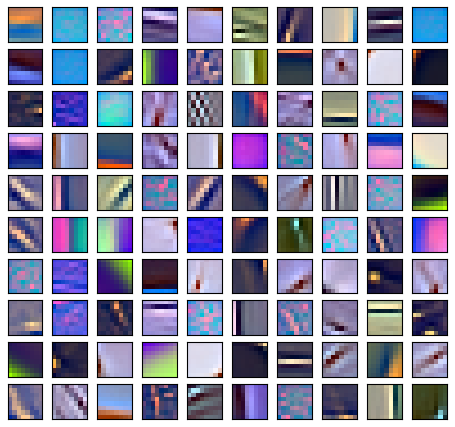

# Lyssandra #
A collection of Python tools for feature extraction and image classification with Sparse Coding algorithms.

## features ##

### Sparse Coding algorithms


Sparse coding is a class of unsupervised methods for learning sets of over-complete dictionaries to represent data efficiently.
Each signal can be expressed as a sparse linear combination of the atoms in the dictionary:



To encode a set of datapoints `X` over a dictionary `D`:

```python
from lyssa.sparse_coding import sparse_encoder

# ...
se = sparse_encoder(algorithm='bomp', params={'n_nonzero_coefs': 5}, n_jobs=8)
Z = se.encode(X, D)
```

Some of the supported solvers include:

   - Orthogonal Matching Pursuit (OMP)
   - Batch OMP [1]
   - Group OMP [2]
   - Non-Negative OMP [3]
   - Iterative Hard Thresholding

### Dictionary Learning algorithms

Learning the dictionary from the data involves solving the following objective



A dictionary learned from image patched of natural images looks like



Supported solvers:
   - K-SVD and its approximate variant [4]
   - Online Dictionary Learning [5]
   - Projected Gradient Descent

### Feature Extraction
   - Spatial Pyramid Matching using Sparse Coding [6]
   - Convolutional Feature Encoders [8]
   - Dense SIFT extraction

### Classification
   - Label Consistent K-SVD [9]
   - Sparse Representation based Classification [10]


## Installation ##

Install the dependencies using:

`pip install -r requirements.txt`


For LASSO problems, the Python version of SPAMS http://spams-devel.gforge.inria.fr/index.html
must be installed in your system.


First edit config.yml to specify the
* workspace path, the location of the directory in which outputs of feature extraction tasks will be saved
* path to OpenBLAS in your system (optional)

and then do:

    pip install .

For best performance, configuring numpy with [OpenBLAS](https://www.openblas.net/) is recommended (see `Dockerfile`).

## Usage ##
Have a look at the `lyssa/examples` folder for some usage examples, and typical workflows.

## References ##

[1] R. Rubinstein, M. Zibulevsky and M. Elad: Efficient Implementation of the K-SVD Algorithm
and the Batch-OMP Method.

[2] A. Lozano, G. Swirszcz, N. Abe: Group Orthogonal Matching Pursuit for
Variable Selection and Prediction.

[3] A. Bruckstein, M. Elad and, M. Zibulevsky: On the
uniqueness of nonnegative sparse solutions to underdetermined
systems of equations. IEEE Trans. Inform.
Theory, 54(11):4813–4820, 2008.

[4] M. Aharon, M. Elad, and A. Bruckstein: K-SVD: An Algorithm for Designing Overcomplete
Dictionaries for Sparse Representation.

[5] J. Mairal, F. Bach, J. Ponce, and G. Sapiro:  Online Dictionary Learning for Sparse Coding.

[6] J. Yang, K. Yu, Y. Gong, and T. Huang: Linear spatial pyramid matching using sparse coding
for image classification, CVPR (2009).

[7] L. Bo, X. Ren, and D. Fox: Hierarchical Matching Pursuit
for Image Classification: Architecture and Fast Algorithms.
In NIPS, 2011.

[8] A. Coates and, A. Y. Ng: The Importance of Encoding Versus Training with Sparse Coding
and Vector Quantization.

[9] Z. Jiang, Z. Lin, and L. S. Davis: Learning a discriminative dictionary for sparse coding via
label consistent k-svd. CVPR, 2011.

[10] J. Wright, A. Yang, A. Ganesh, S. Sastry, and Y. Ma: Robust face recognition via sparse
representation, PAMI (2009).
